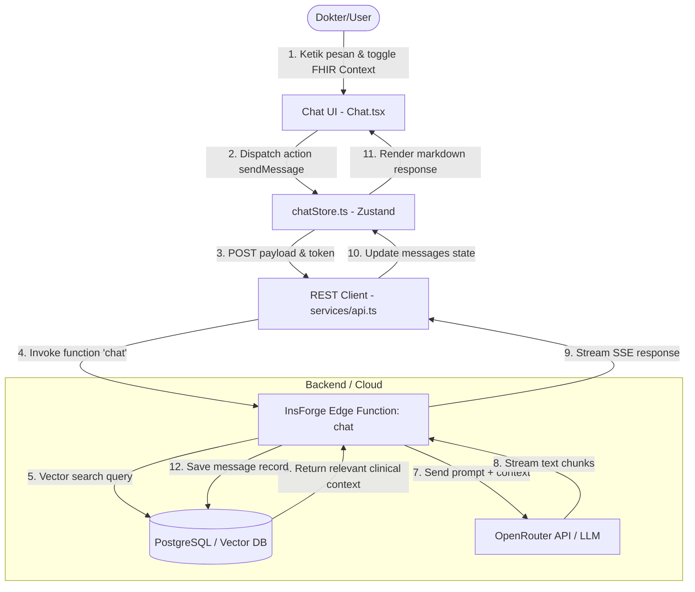
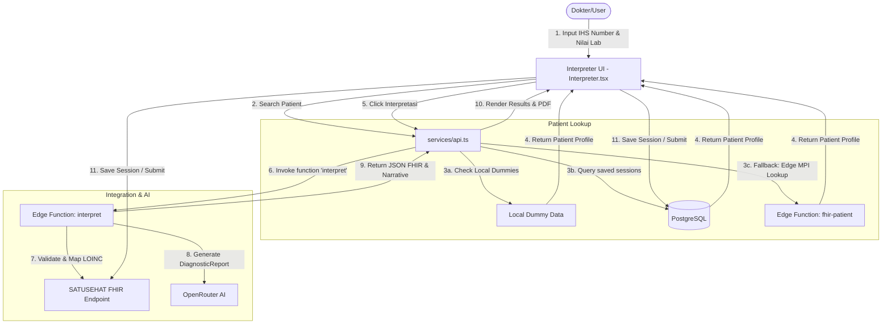
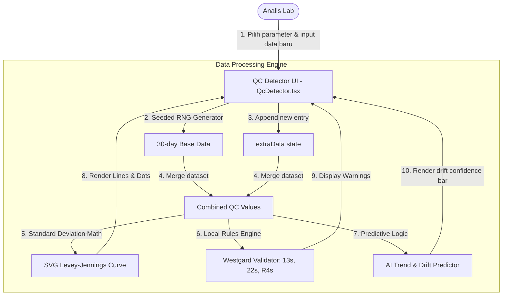
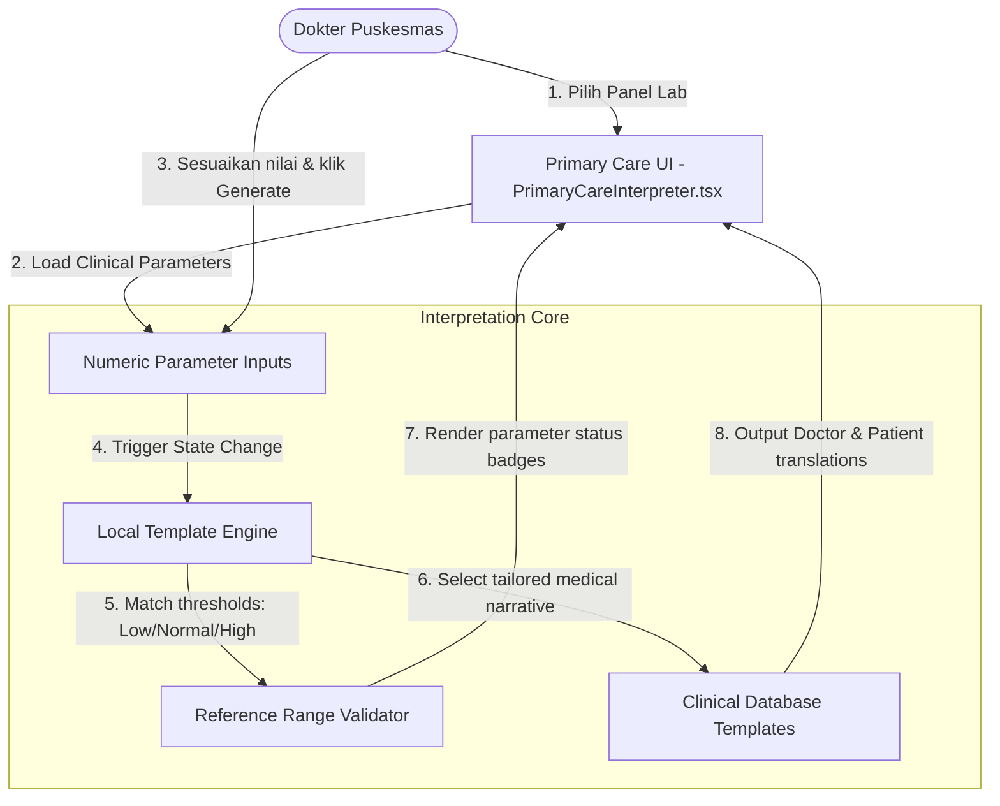
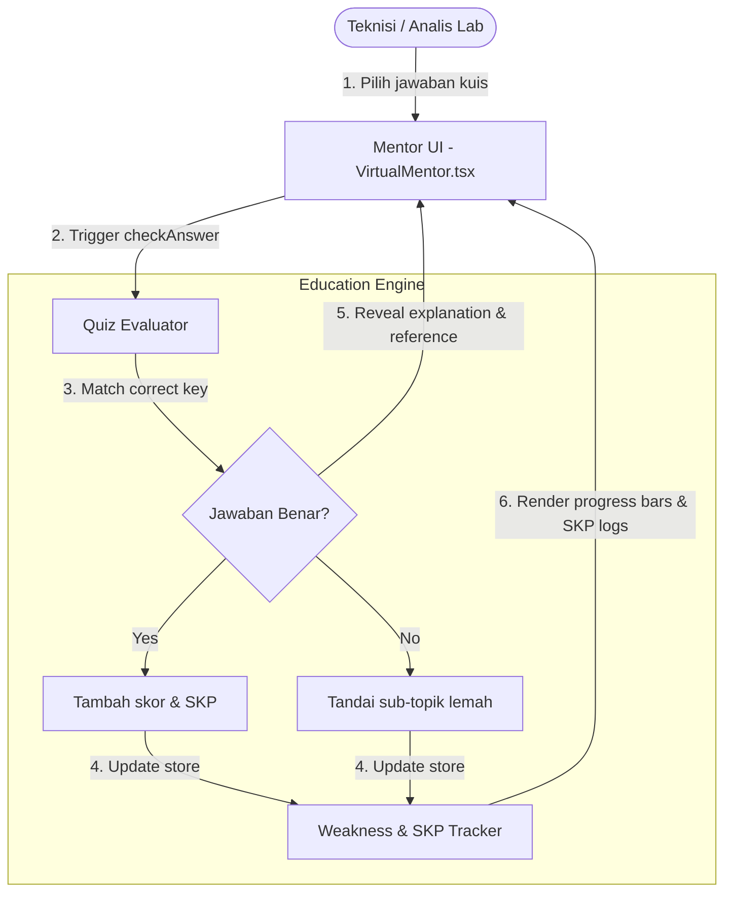
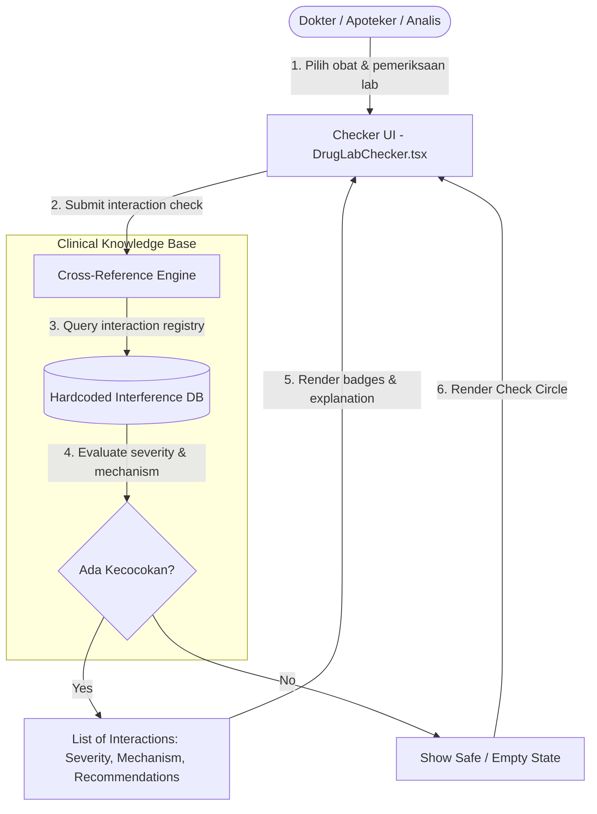
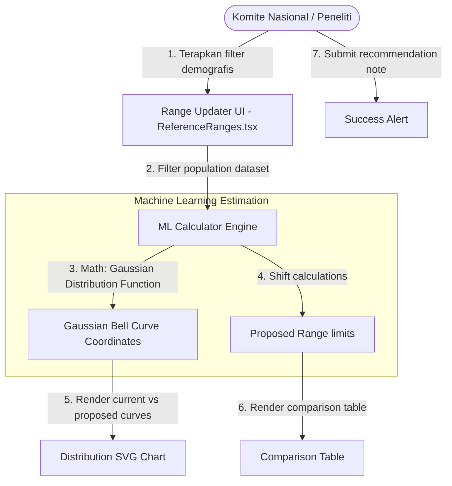

# Data Flow Analysis — IACCLM AI Lab Modules

Dokumen ini menjelaskan aliran data (*data flow*) untuk ketujuh modul yang ada di aplikasi **IACCLM AI Lab**. Penjelasan dilengkapi dengan diagram alir data (*Data Flow Diagram*) menggunakan sintaks Mermaid untuk membantu memahami input, proses state, pemanggilan backend/API, penyimpanan database, dan output visual ke pengguna.

---

## 1. AI Chat & Interpretasi SATUSEHAT (`Chat.tsx`)

Modul ini memproses percakapan interaktif antara dokter dan asisten AI, dengan opsi untuk memasukkan instruksi pemodelan dokumen standar FHIR Kemenkes RI.

### Diagram Alir Data

### Penjelasan Aliran Data
1. **Input**: Dokter mengetik pesan konsultasi klinis dan mengaktifkan checkbox "Kirim Konteks SATUSEHAT".
2. **State & API**: State dikelola oleh `chatStore` (Zustand). Ketika pesan dikirim, store memanggil fungsi API `sendMessage()` yang meneruskan teks dan opsi konteks FHIR ke Edge Function `chat` di InsForge.
3. **Proses AI & RAG**: Edge Function melakukan pencarian semantik (Vector Search) di database untuk menarik data referensi medis/LOINC yang relevan. Data ini disematkan sebagai konteks sistem bersama pesan dokter ke OpenRouter AI.
4. **Output**: Respons teks berupa Markdown dialirkan secara real-time (*Server-Sent Events*) ke UI, dirender menggunakan komponen `ReactMarkdown`, dan riwayat chat disimpan secara persisten di tabel `messages`.

---

## 2. SATUSEHAT Lab Document Interpreter (`Interpreter.tsx`)

Modul untuk menerjemahkan hasil lab mentah menjadi draf dokumen standar FHIR R4 (`Observation` dan `DiagnosticReport`) serta mengirimkannya ke ekosistem SATUSEHAT Kemenkes.

### Diagram Alir Data

### Penjelasan Aliran Data
1. **Pencarian Pasien**: Menggunakan nomor IHS pasien. Sistem memeriksa dummy lokal, kemudian database lokal, dan jika tidak ditemukan, memicu Edge Function `fhir-patient` untuk mencari ke Master Patient Index (MPI) SATUSEHAT.
2. **Input Hasil Lab**: Dokter memasukkan kode LOINC parameter lab (misal `2160-0` untuk Kreatinin) dan nilainya. UI mencocokkan otomatis rentang nilai rujukan berdasarkan jenis kelamin pasien.
3. **Interpretasi FHIR**: Mengirim data sesi ke Edge `interpret` yang mengonversi objek menjadi format FHIR `Observation` & `DiagnosticReport`, memanggil AI untuk menyusun teks kesimpulan klinis, dan mengembalikan data lengkap.
4. **Penyimpanan**: Dokter dapat mengklik "Simpan Sesi" untuk menulis ke tabel `lab_sessions` di PostgreSQL, atau mengirimkan (*submit*) dokumen FHIR yang tervalidasi langsung ke server integrasi SATUSEHAT Kemenkes.

---

## 3. QC Anomaly Detector & Predictor (`QcDetector.tsx`)

Modul pemantauan mutu harian laboratorium (Quality Control) sesuai standar akreditasi SNI ISO 15189 untuk memprediksi kegagalan kontrol sebelum terjadi.

### Diagram Alir Data

### Penjelasan Aliran Data
1. **Generasi Data**: Membaca parameter terpilih (Glukosa, Kreatinin, SGPT). Komponen menggunakan *seeded Random Number Generator* dan algoritma *Box-Muller transform* untuk menyimulasikan data kontrol 30 hari secara konsisten.
2. **Evaluasi Aturan Westgard**: Menggabungkan data bawaan dengan input manual dari state `extraData`. Evaluasi dilakukan secara lokal menggunakan aturan $1_{3s}$ (kesalahan acak), $2_{2s}$ (kesalahan sistematis), $R_{4s}$ (rentang), dan $10_{\bar{x}}$ (bias sistematik berkelanjutan).
3. **Prediksi Drift AI**: Menghitung tren regresi linier secara terprogram untuk memperkirakan pergeseran nilai kontrol (*drift*) serta persentase probabilitas kegagalan di masa mendatang.
4. **Output**: Merender grafik kontrol Levey-Jennings interaktif dalam bentuk grafik SVG murni, lencana status akreditasi lab, dan kartu peringatan tindakan korektif.

---

## 4. Automated Lab Test Interpreter for Primary Care (`PrimaryCareInterpreter.tsx`)

Modul AI klinis yang dirancang khusus untuk mempermudah dokter di Puskesmas atau Klinik Pratama dalam menafsirkan hasil panel laboratorium.

### Diagram Alir Data

### Penjelasan Aliran Data
1. **Seleksi Panel**: Dokter memilih salah satu dari 6 panel bawaan (Diabetes, Ginjal, Hati, Lipid, Anemia, Demam Berdarah).
2. **Evaluasi Nilai**: Komponen membaca nilai numerik yang diinput dan membandingkannya dengan batas klinis spesifik parameter (misal: HbA1c > 6.5% dianggap *Diabetes Mellitus*).
3. **Generasi Interpretasi**: Sistem memetakan status parameter ke template narasi medis yang telah divalidasi, memisahkan penjelasan menjadi dua sasaran:
   * **Ringkasan Dokter**: Penjelasan teknis medis, diagnosis banding, dan referensi standar.
   * **Penjelasan Pasien**: Bahasa komunikatif bebas jargon medis, analogi sederhana, dan panduan gaya hidup.

---

## 5. Virtual Mentor for Continuous Education (`VirtualMentor.tsx`)

Modul pembelajaran berkelanjutan (*continuous education*) adaptif untuk meningkatkan kompetensi teknisi lab melalui kuis studi kasus dan pelacakan kelemahan.

### Diagram Alir Data

### Penjelasan Aliran Data
1. **Interaksi Kuis**: Pengguna membaca studi kasus klinis (misal kesalahan kalibrasi instrumen fotometri) dan memilih salah satu opsi jawaban.
2. **Evaluasi Kuis**: Sistem memvalidasi jawaban secara instan. Jika benar, skor harian dan kredit SKP (Satuan Kredit Profesi) bertambah. Jika salah, sub-topik studi kasus tersebut ditandai.
3. **Pelacakan Kemajuan**: Data performa dikumpulkan secara lokal untuk memperbarui tracker kelemahan (*Weakness Tracker*) pengguna pada beberapa sub-bidang utama (Validasi Metode, Kalibrasi, Kimia Klinik, dll.) yang ditampilkan menggunakan batang progres visual.

---

## 6. AI-Based Drug-Laboratory Interaction Checker (`DrugLabChecker.tsx`)

Modul keselamatan pasien untuk mendeteksi potensi interferensi obat-obatan atau suplemen terhadap hasil reaksi kimia/biokimia pengujian laboratorium.

### Diagram Alir Data

### Penjelasan Aliran Data
1. **Input**: Pengguna memilih daftar obat/suplemen yang dikonsumsi pasien (misal Vitamin C) dan pemeriksaan laboratorium yang direncanakan (misal Glukosa GOD-PAP dan Troponin I).
2. **Proses Analisis**: Mesin mencocokkan setiap pasangan obat dan pengujian secara silang ke basis pengetahuan interferensi klinis internal.
3. **Evaluasi Mekanisme**: Jika kecocokan ditemukan (misal: Vitamin C mengganggu reaksi oksidasi enzimatik pada metode GOD-PAP karena sifat reduktor kuatnya, memicu hasil *false low*), sistem mengambil data detail:
   * **Keparahan**: Signifikan (Merah), Moderat (Kuning), Minor (Biru).
   * **Mekanisme**: Penjelasan reaksi biokimia interferensi tersebut.
   * **Rekomendasi**: Tindakan mitigasi (misal mengganti metode tes, atau menunda konsumsi obat).

---

## 7. Predictive Reference Range Updater (`ReferenceRanges.tsx`)

Modul analisis data populasi berskala besar untuk merumuskan usulan nilai interval rujukan laboratorium nasional baru yang lebih spesifik bagi demografis Indonesia.

### Diagram Alir Data

### Penjelasan Aliran Data
1. **Penerapan Filter**: Pengguna memilih filter Jenis Kelamin, Rentang Usia, dan Wilayah Geografis Indonesia.
2. **Kalkulasi ML**: Komponen memproses dataset 1,2 juta sampel secara dinamis. Menggunakan formula Gaussian untuk memproyeksikan kurva distribusi normal yang baru. Rentang nilai rujukan bergeser secara adaptif (misal: memilih demografi "Perempuan" akan menggeser rentang usulan kreatinin ke angka yang lebih rendah).
3. **Output Visual**: SVG dinamis memplot dua kurva lonceng yang tumpang tindih (kurva abu-abu untuk batas rujukan nasional saat ini, kurva biru untuk usulan berbasis model Bayesian).
4. **Aksi**: Pengguna dapat memasukkan catatan justifikasi klinis dan mengirimkannya ke komite evaluasi pusat.
